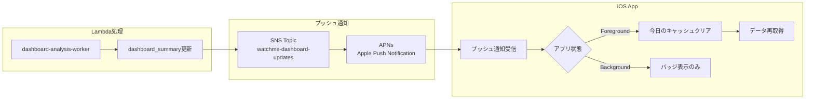

# WatchMe プッシュ通知アーキテクチャ（AWS SNS + APNs）

**作成日**: 2025-10-13
**ステータス**: 設計中

---

## 📊 概要

Lambda処理完了後、iOSアプリにリアルタイムでデータ更新を通知するため、AWS SNS + Apple Push Notification service (APNs)を使用します。

### 🎯 目的

- Lambda処理完了後、即座にiOSアプリに通知
- ユーザーがアプリを開いているときは自動的にデータ再取得
- スケーラブルで信頼性の高い通知システム

---

## 🏗️ アーキテクチャ



---

## 🔧 実装手順

### Phase 1: AWS SNS設定

#### 1-1. SNS Topicの作成

```bash
# AWS CLIで作成
aws sns create-topic --name watchme-dashboard-updates --region ap-northeast-1
```

**設定:**
- Topic名: `watchme-dashboard-updates`
- リージョン: `ap-northeast-1` (東京)
- 配信ポリシー: デフォルト

#### 1-2. APNs Platform Applicationの作成

Apple Developer Centerから取得した証明書を使用してAPNs Platform Applicationを作成：

```bash
aws sns create-platform-application \
  --name watchme-ios-app \
  --platform APNS \
  --attributes PlatformCredential=<APNs証明書のp12ファイル>
```

**必要なもの:**
- APNs証明書 (.p12ファイル)
- 証明書のパスワード

---

### Phase 2: Lambda側の実装

#### 2-1. IAMロールにSNS権限を追加

Lambda関数 `watchme-dashboard-analysis-worker` のIAMロールに以下のポリシーを追加：

```json
{
  "Version": "2012-10-17",
  "Statement": [
    {
      "Effect": "Allow",
      "Action": [
        "sns:Publish"
      ],
      "Resource": "arn:aws:sns:ap-northeast-1:*:watchme-dashboard-updates"
    }
  ]
}
```

#### 2-2. Lambda関数コード修正

`dashboard-analysis-worker/main.py` に以下を追加：

```python
import boto3
import json

sns_client = boto3.client('sns', region_name='ap-northeast-1')
SNS_TOPIC_ARN = 'arn:aws:sns:ap-northeast-1:YOUR_ACCOUNT_ID:watchme-dashboard-updates'

# dashboard_summary更新後に追加
def send_push_notification(device_id: str, date: str):
    """プッシュ通知をSNS経由で送信"""
    try:
        message = {
            'default': 'Dashboard updated',
            'APNS': json.dumps({
                'aps': {
                    'alert': {
                        'title': 'データ更新完了',
                        'body': '新しい分析結果が利用可能です'
                    },
                    'sound': 'default',
                    'badge': 1
                },
                'device_id': device_id,
                'date': date,
                'action': 'refresh_dashboard'
            })
        }

        response = sns_client.publish(
            TopicArn=SNS_TOPIC_ARN,
            Message=json.dumps(message),
            MessageStructure='json',
            MessageAttributes={
                'device_id': {
                    'DataType': 'String',
                    'StringValue': device_id
                }
            }
        )

        print(f"✅ Push notification sent: {response['MessageId']}")
        return True

    except Exception as e:
        print(f"❌ Failed to send push notification: {e}")
        return False

# dashboard_summaryをupsert後に呼び出す
upsert_result = supabase.table('dashboard_summary').upsert(data).execute()
if upsert_result:
    send_push_notification(device_id, date)
```

---

### Phase 3: iOS側の実装

#### 3-1. プッシュ通知の権限設定

**Project Settings → Capabilities:**
- Push Notifications: ON
- Background Modes: ON
  - Remote notifications にチェック

#### 3-2. APNs証明書の取得

1. Apple Developer Center → Certificates → (+) 新規作成
2. Apple Push Notification service SSL (Sandbox & Production) を選択
3. App IDを選択: `com.yourcompany.ios-watchme-v9`
4. CSRをアップロード
5. 証明書をダウンロード (.cer)
6. Keychain AccessでExport → .p12ファイル作成

#### 3-3. iOS AppDelegate修正

`ios_watchme_v9App.swift` に以下を追加：

```swift
import SwiftUI
import UserNotifications

@main
struct ios_watchme_v9App: App {
    @UIApplicationDelegateAdaptor(AppDelegate.self) var appDelegate

    // 既存のコード...
}

class AppDelegate: NSObject, UIApplicationDelegate, UNUserNotificationCenterDelegate {

    func application(_ application: UIApplication,
                    didFinishLaunchingWithOptions launchOptions: [UIApplication.LaunchOptionsKey: Any]?) -> Bool {

        // プッシュ通知の権限リクエスト
        UNUserNotificationCenter.current().delegate = self
        UNUserNotificationCenter.current().requestAuthorization(options: [.alert, .sound, .badge]) { granted, error in
            if granted {
                print("✅ Push notification permission granted")
                DispatchQueue.main.async {
                    application.registerForRemoteNotifications()
                }
            } else {
                print("❌ Push notification permission denied: \(error?.localizedDescription ?? "")")
            }
        }

        return true
    }

    // デバイストークン取得成功
    func application(_ application: UIApplication,
                    didRegisterForRemoteNotificationsWithDeviceToken deviceToken: Data) {
        let token = deviceToken.map { String(format: "%02.2hhx", $0) }.joined()
        print("📱 Device Token: \(token)")

        // TODO: このトークンをSupabaseに保存
        saveDeviceToken(token)
    }

    // デバイストークン取得失敗
    func application(_ application: UIApplication,
                    didFailToRegisterForRemoteNotificationsWithError error: Error) {
        print("❌ Failed to register for remote notifications: \(error)")
    }

    // フォアグラウンドで通知受信
    func userNotificationCenter(_ center: UNUserNotificationCenter,
                               willPresent notification: UNNotification,
                               withCompletionHandler completionHandler: @escaping (UNNotificationPresentationOptions) -> Void) {

        let userInfo = notification.request.content.userInfo
        print("📬 Notification received (foreground): \(userInfo)")

        // dashboard_summary更新通知の場合
        if let action = userInfo["action"] as? String, action == "refresh_dashboard" {
            handleDashboardUpdate(userInfo)
        }

        // 通知を表示（オプション）
        completionHandler([.banner, .sound])
    }

    // 通知タップ時
    func userNotificationCenter(_ center: UNUserNotificationCenter,
                               didReceive response: UNNotificationResponse,
                               withCompletionHandler completionHandler: @escaping () -> Void) {

        let userInfo = response.notification.request.content.userInfo
        print("📬 Notification tapped: \(userInfo)")

        handleDashboardUpdate(userInfo)
        completionHandler()
    }

    // ダッシュボード更新処理
    private func handleDashboardUpdate(_ userInfo: [AnyHashable: Any]) {
        guard let deviceId = userInfo["device_id"] as? String,
              let date = userInfo["date"] as? String else {
            print("⚠️ Invalid notification payload")
            return
        }

        print("🔄 Dashboard update notification: deviceId=\(deviceId), date=\(date)")

        // TODO: 今日のキャッシュをクリアして再取得
        NotificationCenter.default.post(
            name: NSNotification.Name("RefreshDashboard"),
            object: nil,
            userInfo: ["device_id": deviceId, "date": date]
        )
    }

    private func saveDeviceToken(_ token: String) {
        // TODO: SupabaseのdevicesテーブルにAPNsトークンを保存
        Task {
            do {
                let supabase = SupabaseClientManager.shared.client
                // devices テーブルに apns_token カラムを追加済みと仮定
                try await supabase
                    .from("devices")
                    .update(["apns_token": token])
                    .eq("device_id", value: "CURRENT_DEVICE_ID") // 実際のデバイスIDに置き換え
                    .execute()

                print("✅ Device token saved to Supabase")
            } catch {
                print("❌ Failed to save device token: \(error)")
            }
        }
    }
}
```

#### 3-4. SimpleDashboardViewで通知を監視

```swift
struct SimpleDashboardView: View {
    // 既存のコード...

    var body: some View {
        // 既存のUI...
        .onReceive(NotificationCenter.default.publisher(for: NSNotification.Name("RefreshDashboard"))) { notification in
            guard let userInfo = notification.userInfo,
                  let deviceId = userInfo["device_id"] as? String,
                  let date = userInfo["date"] as? String else {
                return
            }

            print("🔄 [Push] Refreshing dashboard for \(deviceId) on \(date)")

            // 今日のキャッシュをクリア
            let calendar = deviceManager.deviceCalendar
            let today = calendar.startOfDay(for: Date())
            let formatter = DateFormatter()
            formatter.dateFormat = "yyyy-MM-dd"
            formatter.timeZone = deviceManager.getTimezone(for: deviceId)
            let todayString = formatter.string(from: today)
            let todayCacheKey = "\(deviceId)_\(todayString)"

            dataCache.removeValue(forKey: todayCacheKey)
            cacheKeys.removeAll { $0 == todayCacheKey }

            // データ再取得
            Task {
                await loadAllData()
            }
        }
    }
}
```

---

## 📋 データベース修正

### devicesテーブルにAPNsトークンカラムを追加

```sql
ALTER TABLE public.devices
ADD COLUMN apns_token TEXT;

CREATE INDEX idx_devices_apns_token ON public.devices(apns_token);
```

---

## 🧪 テスト手順

### 1. Lambda側のテスト

```python
# test_push_notification.py
from main import send_push_notification

send_push_notification(
    device_id='1cf67321-f1aa-4c51-b642-cbd7837c45d5',
    date='2025-10-13'
)
```

### 2. iOS側のテスト

1. 実機でアプリを起動（シミュレーターはプッシュ通知非対応）
2. プッシュ通知の権限を許可
3. デバイストークンがコンソールに出力されることを確認
4. Lambda関数を手動実行してプッシュ通知送信
5. iOSでプッシュ通知を受信することを確認

---

## 💰 コスト見積もり

### AWS SNS

- **料金**: 100万メッセージまで無料、以降$0.50/100万メッセージ
- **使用量**: 48回/日 × 30日 = 1,440回/月
- **月額コスト**: $0 (無料枠内)

### APNs

- Appleからの課金なし（無料）

---

## 🚀 次のステップ

1. ✅ Supabase Realtime関連コード削除
2. ⏳ AWS SNS Topic作成
3. ⏳ APNs証明書取得
4. ⏳ Lambda関数修正
5. ⏳ iOS側実装
6. ⏳ テスト実施

---

## 📚 参考資料

- AWS SNS APNs連携: https://docs.aws.amazon.com/sns/latest/dg/sns-mobile-application-as-subscriber.html
- Apple Push Notifications: https://developer.apple.com/documentation/usernotifications
- Swift UserNotifications: https://developer.apple.com/documentation/usernotifications

---

*最終更新: 2025-10-13*
