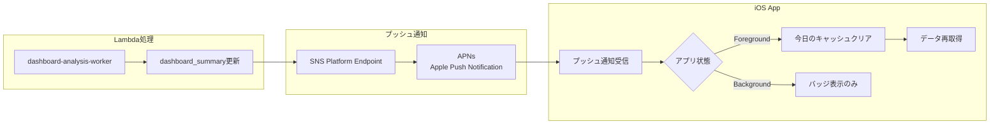

# WatchMe プッシュ通知アーキテクチャ（AWS SNS + APNs）

**作成日**: 2025-10-13
**最終更新**: 2025-10-14
**ステータス**: 🚧 実装中・テスト待ち

---

## 📊 概要

Lambda処理完了後、iOSアプリにリアルタイムでデータ更新を通知するため、AWS SNS + Apple Push Notification service (APNs)を使用します。

### 🎯 目的

- Lambda処理完了後、即座にiOSアプリに通知
- ユーザーがアプリを開いているときは自動的にデータ再取得
- スケーラブルで信頼性の高い通知システム

---

## 🏗️ アーキテクチャ



---

## ✅ 実装済み内容（2025-10-14）

### 1. AWS SNS Platform Application

#### 開発環境（Sandbox）
- **名前**: `watchme-ios-app-sandbox`
- **ARN**: `arn:aws:sns:ap-southeast-2:754724220380:app/APNS_SANDBOX/watchme-ios-app-sandbox`
- **証明書**: Sandbox用APNs証明書（有効期限: 確認要）
- **用途**: Xcodeから直接インストールしたアプリ

#### 本番環境（Production）
- **名前**: `watchme-ios-app`
- **ARN**: `arn:aws:sns:ap-southeast-2:754724220380:app/APNS/watchme-ios-app`
- **証明書**: Production用APNs証明書（有効期限: 2026-11-12）
- **用途**: TestFlight/App Store公開版

---

### 2. Lambda関数実装

**ファイル**: `/Users/kaya.matsumoto/projects/watchme/server-configs/lambda-functions/watchme-dashboard-analysis-worker/lambda_function.py`

#### 主要機能

1. **プッシュ通知送信** (`send_push_notification`)
   - SupabaseからAPNsトークンを取得
   - SNS Platform Endpointを自動作成または更新
   - プッシュ通知を送信

2. **Endpoint自動再有効化**
   - `EndpointDisabledException`を自動検知
   - Endpointを再有効化してリトライ

3. **現在の設定**
   - **環境**: Sandbox（開発用）
   - **通知タイプ**: 通常の通知（バナー表示）※テスト用
   - **ペイロード**: `APNS_SANDBOX`

```python
SNS_PLATFORM_APP_ARN = 'arn:aws:sns:ap-southeast-2:754724220380:app/APNS_SANDBOX/watchme-ios-app-sandbox'

message = {
    'APNS_SANDBOX': json.dumps({
        'aps': {
            'alert': {
                'title': 'データ更新完了',
                'body': '新しい分析結果が利用可能です'
            },
            'sound': 'default',
            'content-available': 1
        },
        'device_id': device_id,
        'date': date,
        'action': 'refresh_dashboard'
    })
}
```

---

### 3. IAM権限設定

**ロール**: `watchme-dashboard-analysis-worker-role-ff2gu1tt`

**ポリシー**: `SNSPushNotificationPolicy`

```json
{
  "Version": "2012-10-17",
  "Statement": [
    {
      "Effect": "Allow",
      "Action": [
        "sns:Publish",
        "sns:CreatePlatformEndpoint",
        "sns:SetEndpointAttributes",
        "sns:GetEndpointAttributes"
      ],
      "Resource": [
        "arn:aws:sns:ap-southeast-2:754724220380:app/APNS/watchme-ios-app",
        "arn:aws:sns:ap-southeast-2:754724220380:endpoint/APNS/watchme-ios-app/*",
        "arn:aws:sns:ap-southeast-2:754724220380:app/APNS_SANDBOX/watchme-ios-app-sandbox",
        "arn:aws:sns:ap-southeast-2:754724220380:endpoint/APNS_SANDBOX/watchme-ios-app-sandbox/*"
      ]
    }
  ]
}
```

---

### 4. iOS側実装

#### デバイストークン管理
- ✅ APNsデバイストークン取得機能実装済み
- ✅ トークンをSupabase `users.apns_token`に保存（2025-10-14修正）
- ✅ ログイン後に自動的にトークン登録・保存
- ✅ テストデバイストークン: `7cb89fa1198f12001efa7ab7aa45cbfc3f04b7b15d113911f9058cbd348a2652`

#### プッシュ通知ハンドラー
- ✅ `AppDelegate`実装済み
- ✅ フォアグラウンド受信処理
- ✅ バックグラウンド受信処理
- ✅ 通知タップ時の処理
- ✅ トーストバナー表示実装済み（フォアグラウンド時）

---

## 🐛 解決した問題

### 問題1: UNUserNotificationCenterDelegateが設定されていない（2025-10-14）
**エラー**: プッシュ通知が届かない（Xcodeコンソールに何も出力されない）

**原因**: `UNUserNotificationCenter.current().delegate = self`が設定されていなかった

**解決**:
`ios_watchme_v9App.swift`の`AppDelegate.didFinishLaunchingWithOptions`に追加：
```swift
UNUserNotificationCenter.current().delegate = self
```

---

### 問題2: TabView内で通知が重複受信される（2025-10-14）
**現象**: 1回の通知で7回のキャッシュクリア・データ再取得が実行される

**原因**: TabViewが複数のSimpleDashboardViewインスタンスを事前生成し、全てが`onReceive`で同じ通知を受信していた

**解決**:
`SimpleDashboardView.swift`の`onReceive`処理を修正：
- このビューの`date`が今日でない場合は早期リターン
- 不要なログ出力を削減

```swift
// このビューが今日を表示中の場合のみ処理
guard calendar.isDate(date, inSameDayAs: today) else {
    return
}
```

---

### 問題3: Lambda関数で`requests`ライブラリがない
**エラー**: `Runtime.ImportModuleError: No module named 'requests'`

**原因**: 依存ライブラリがデプロイパッケージに含まれていなかった

**解決**:
```bash
cd /Users/kaya.matsumoto/projects/watchme/server-configs/lambda-functions/watchme-dashboard-analysis-worker
./build.sh
aws lambda update-function-code --function-name watchme-dashboard-analysis-worker --zip-file fileb://function.zip --region ap-southeast-2
```

---

### 問題4: APNs環境のミスマッチ
**エラー**: `EndpointDisabled`

**原因**:
- SNS Platform Application = **Production環境（APNS）**
- iOSアプリ（Xcodeビルド） = **Sandbox環境**
- 環境が一致していなかった

**解決**:
1. Sandbox用APNs証明書を作成（`.p12`）
2. SNS Platform Application `watchme-ios-app-sandbox`を作成
3. Lambda関数を`APNS_SANDBOX`に変更

---

### 問題5: IAM権限不足
**エラー**: `AuthorizationError: User is not authorized to perform: SNS:CreatePlatformEndpoint on resource: arn:aws:sns:.../APNS_SANDBOX/...`

**原因**: IAMポリシーが本番環境のARNのみ許可していた

**解決**: IAMポリシーにSandbox環境のARNを追加

---

### 問題6: APNsトークンの保存先が間違っている（2025-10-14）
**エラー**: トークンが取得できない、または間違ったデバイスでプッシュ通知が動作しない

**原因**:
- APNsトークンを`devices`テーブルに保存していた（設計ミス）
- `user_devices.role='owner'`で絞り込んでいたため、一部デバイスで通知が届かない

**解決**:
1. **データベース設計変更**
   - APNsトークンの保存先を`devices`→`users`テーブルに変更
   - `users.apns_token`カラムを追加
   - `devices.apns_token`カラムを削除

2. **iOS側修正**
   - `DeviceManager.swift`: トークン保存処理を`users`テーブルに変更
   - `UserAccountManager.swift`: ログイン後にAPNsトークン登録を要求

3. **Lambda側修正**
   - `role='owner'`条件を完全に削除
   - デバイスに紐づく全ユーザーの`user_id`を取得
   - 各ユーザーの`apns_token`をチェックし、最初に見つかったトークンを使用

**修正後のフロー**:
```
Lambda処理完了
  ↓
device_id から user_devices テーブルを検索（roleに関係なく）
  ↓
user_id のリストを取得
  ↓
各 user_id について users.apns_token をチェック
  ↓
最初に見つかったトークンでプッシュ通知送信
```

---

## 📋 データベース構造

### usersテーブル（2025-10-14修正）

```sql
-- APNsトークンの保存先をusersテーブルに変更
ALTER TABLE public.users
ADD COLUMN apns_token TEXT;

CREATE INDEX idx_users_apns_token ON public.users(apns_token);

-- 旧devicesテーブルのカラムを削除
ALTER TABLE public.devices DROP COLUMN IF EXISTS apns_token;
DROP INDEX IF EXISTS idx_devices_apns_token;
```

**設計変更の理由：**
- APNsトークン = **このユーザーが使っているiPhone**を識別
- 観測対象デバイス（松本遍、松本正弦など）とは無関係
- 正しい保存先：`public.users.apns_token`

**現在の状態**: ✅ カラム追加済み、トークン保存済み

---

## 🧪 テスト状況

### Lambda側
- ✅ APNsトークン取得処理: 実装完了（`users`テーブルから取得）
- ✅ `role`条件削除: 完了（全ユーザーに対応）
- ✅ Endpoint自動作成: 実装済み
- ✅ Endpoint自動再有効化: 実装済み
- ✅ CloudWatch Logs: 詳細ログ出力中
- 🚧 プッシュ通知送信: **テスト待ち**（次の30分スロットで検証）

### iOS側
- ✅ デバイストークン取得: 成功
- ✅ トークン保存: 成功（`users.apns_token`に保存済み）
- ✅ ログイン後のトークン登録: 実装完了
- ✅ プッシュ通知ハンドラー: 実装済み
- ✅ トーストバナー表示: 実装済み
- 🚧 プッシュ通知受信: **テスト待ち**
- 🚧 フォアグラウンド時の自動データ更新: **テスト待ち**

### 確認済みの動作
- ✅ ログイン時のAPNsトークン保存: 動作確認済み
  ```
  🔔 [PUSH] ログイン後、保留中のAPNsトークンを保存します
  ✅ [PUSH] APNsトークン保存成功: userId=164cba5a-dba6-4cbc-9b39-4eea28d98fa5
  ```
- ✅ Lambda関数のデプロイ: 最新版デプロイ済み（2025-10-14 18:11 JST）

---

## 🔄 次のステップ

### 1. 動作確認（最優先）

#### テスト手順
1. **次の30分スロット（18:00、18:30など）でLambda実行を待つ**
2. **CloudWatch Logsで以下を確認**:
   ```
   [PUSH] Step 1: Getting all user_ids for device: ...
   [PUSH] Found N user(s) for device: [...]
   [PUSH] Step 2: Getting APNs token for user: ...
   [PUSH] ✅ APNs token found for user: ..., token: 7cb89fa1...
   [PUSH] ✅ Push notification sent successfully
   ```
3. **iOSアプリでプッシュ通知受信を確認**
   - フォアグラウンド時: トーストバナー表示
   - バックグラウンド時: 通知バナー表示

#### 未解決の問題
- ⚠️ バックグラウンドスレッドから`@Published`プロパティを更新している警告（大量）
  - 場所: `UserAccountManager.swift`のトークンリフレッシュ処理
  - 影響: 現時点では動作に問題なし（警告のみ）
  - 修正: `MainActor`で囲む必要あり

---

### 2. テスト完了後の作業

#### サイレント通知に戻す
現在はテスト用に通常の通知（バナー表示）を使用。本番運用時はサイレント通知に変更：

```python
message = {
    'APNS_SANDBOX': json.dumps({
        'aps': {
            'content-available': 1  # サイレント通知のみ
        },
        'device_id': device_id,
        'date': date,
        'action': 'refresh_dashboard'
    })
}
```

#### 本番環境への切り替え
TestFlightまたはApp Store公開時：
```python
SNS_PLATFORM_APP_ARN = 'arn:aws:sns:ap-southeast-2:754724220380:app/APNS/watchme-ios-app'  # Production
message = {'APNS': json.dumps({...})}  # APNS_SANDBOX → APNS
```

---

### 2. 環境自動切り替え（推奨）

環境変数で自動切り替え：

```python
import os

# 環境判定
ENV = os.environ.get('ENV', 'development')  # development | production

if ENV == 'production':
    SNS_PLATFORM_APP_ARN = 'arn:aws:sns:ap-southeast-2:754724220380:app/APNS/watchme-ios-app'
    MESSAGE_KEY = 'APNS'
else:
    SNS_PLATFORM_APP_ARN = 'arn:aws:sns:ap-southeast-2:754724220380:app/APNS_SANDBOX/watchme-ios-app-sandbox'
    MESSAGE_KEY = 'APNS_SANDBOX'
```

---

## 💰 コスト見積もり

### AWS SNS
- **料金**: 100万メッセージまで無料、以降$0.50/100万メッセージ
- **使用量**: 48回/日 × 30日 = 1,440回/月
- **月額コスト**: $0（無料枠内）

### APNs
- Appleからの課金なし（無料）

---

## 📚 参考資料

- [AWS SNS APNs連携](https://docs.aws.amazon.com/sns/latest/dg/sns-mobile-application-as-subscriber.html)
- [Apple Push Notifications](https://developer.apple.com/documentation/usernotifications)
- [Swift UserNotifications](https://developer.apple.com/documentation/usernotifications)

---

## 🔧 トラブルシューティング

### プッシュ通知が届かない場合

1. **CloudWatch Logsを確認**
   - ログストリームに`[PUSH] ✅ Push notification sent successfully`があるか
   - エラーログがないか

2. **SNS Endpointの状態を確認**
   - AWS Console → SNS → Applications → Endpoints
   - ステータスが「有効」になっているか

3. **iOSアプリの権限を確認**
   - 設定 → 通知 → アプリ名 → 通知を許可

4. **環境の一致を確認**
   - Xcodeビルド → Sandbox環境
   - TestFlight/App Store → Production環境

---

## 📝 修正履歴

### 2025-10-14
- ✅ データベース設計変更：APNsトークンを`devices`→`users`テーブルに移行
- ✅ iOS側実装：ログイン後のトークン登録処理を追加
- ✅ Lambda側実装：`role='owner'`条件を削除、全ユーザーに対応
- ✅ トーストバナー表示機能を追加
- 🚧 プッシュ通知の動作確認待ち

---

*最終更新: 2025-10-14 18:20 JST*
